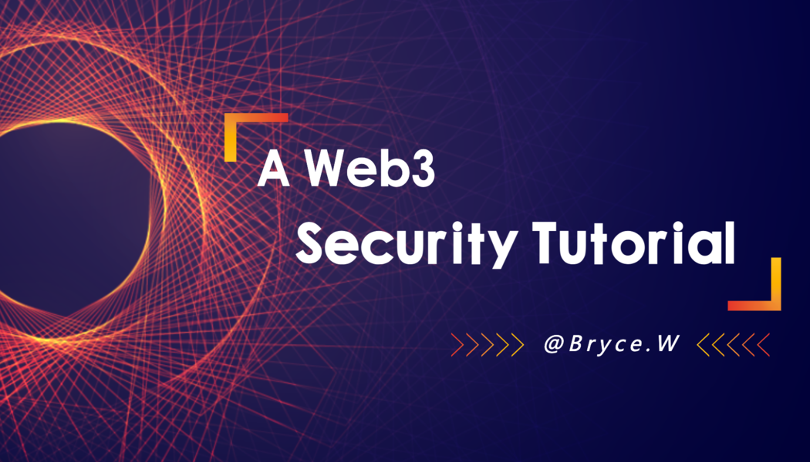

# Web3 Security

**A Web3 Security Tutorial**

  

**Twitter:** [@brycewai](https://twitter.com/brycewai)  
**所有Github和教程开源在Github:** [https://github.com/BryceWai/Web3-Security](https://github.com/BryceWai/Web3-Security)

## 区块链基础

**F01: [什么是区块链](./basis/blockchain/readme.md)**

**F02: [区块链通用模型](./basis/model/readme.md)**

**F03: [比特币模型详解](./basis/btc/readme.md)**

**F04: [以太坊模型详解](./basis/ethereum/readme.md)**

**F05: [常用工具和资料汇总](https://brycewai.github.io/2022/08/07/%E5%8C%BA%E5%9D%97%E9%93%BE%E5%B8%B8%E7%94%A8%E5%B7%A5%E5%85%B7%E5%92%8C%E8%B5%84%E6%96%99/)**

## Solidity

### `Solidity 入门`

本着不重复造轮子的理念，在此向大家推荐[WTF Academy - Solidity入门](https://wtf.academy/solidity-start)

### `Solidity 进阶`

本着不重复造轮子的理念，在此向大家推荐[WTF Academy - Solidity 进阶](https://wtf.academy/solidity-advanced)

## 常见协议和提案

### `Token`

[ERC 20](https://ethereum.org/en/developers/docs/standards/tokens/erc-20/)

[ERC 721](https://ethereum.org/en/developers/docs/standards/tokens/erc-721/)

[ERC 777](https://ethereum.org/en/developers/docs/standards/tokens/erc-777/)

[ERC 1155](https://ethereum.org/en/developers/docs/standards/tokens/erc-1155/)

### `安全相关提案`

[ERC 155](https://eips.ethereum.org/EIPS/eip-155)

[ERC 191](https://eips.ethereum.org/EIPS/eip-191)

[ERC 712](https://eips.ethereum.org/EIPS/eip-712)

## 区块链安全与审计

### `链平台安全审计`

**CS01: [公链安全审计项](./vulnerability/chain/readme.md#公链安全审计项)**

### `智能合约安全漏洞`

**SS01: [重入攻击（Reentrancy）](./vulnerability/smartContract/readme.md#重入攻击reentrancy)**

**SS02: [整型溢出漏洞（overflow）](./vulnerability/smartContract/readme.md#整型溢出漏洞overflow)**

**SS03: [tx.origin漏洞](./vulnerability/smartContract/readme.md#txorigin漏洞)**

**SS04: [拒绝服务攻击（DoS）](./vulnerability/smartContract/readme.md#拒绝服务攻击dos)**

**SS05: [预言机操纵（Oracle Manipulation）](./vulnerability/smartContract/readme.md#预言机操纵oracle-manipulation)**

**SS06: [闪电贷攻击（Flashloan）](./vulnerability/smartContract/readme.md#闪电贷攻击)**

## 智能合约安全事件分析

| 注：安全事件分析的文章来源于 Beosin 安全研究和审计团队

[孙宇晨旗下Poloniex被盗上亿美元，Raft项目被盗340万美元，上周黑客为何如此猖獗？](https://mp.weixin.qq.com/s/1X6m4m44htHwSV-RiSzydA)

[同样的漏洞，同样的遭遇，OnyxProtocol受黑客攻击损失218万美元分析](https://mp.weixin.qq.com/s/T1UC1fiHbFIlI1xusC0cMg)

[精妙的Bypass！黑客获利超700万美元，Op链上Exactly Protocol遭黑客攻击事件分析](https://mp.weixin.qq.com/s/yhsEq8QbqcsMyHgNOHhgKw)

[“任性”的代价？Zunami Protocol因价格操纵被攻击，损失超过 210 万美元](https://mp.weixin.qq.com/s/3Bnk32XC2reL9l6_h75VKQ)

[多个项目被黑，因Vyper重入锁漏洞造成的损失已超5900w美元，你的资金还安全吗？](https://mp.weixin.qq.com/s/iRqPp-uTJ0dGZiPzA0OmUw)

[Eralend遭受攻击损失340万美元，黑客会选择返还资金吗？](https://mp.weixin.qq.com/s/Uy_wxUMFEJPQc9UFLD4Iaw)

[扑朔迷离的一次盗币案件？涉及资金约1.26亿美元——Multichain黑客盗币案分析](https://mp.weixin.qq.com/s/eODFRnJxZZI7d7UwJNyLTA)

[麻吉大哥重金买入的项目却遭黑客攻击？——Jimbos protocol攻击事件分析](https://mp.weixin.qq.com/s/wTwHdDxUpkvUomwL1YHJCg)

[黑客获利约630万美元，算法稳定币$DEI被攻击事件分析](https://mp.weixin.qq.com/s/Wnj0qqzu5RY7SeadUcZmsw)

[损失200万美元，DeFi 协议0vix Protocol遭受闪电贷攻击是怎么回事？](https://mp.weixin.qq.com/s/c-iFmep0JsDU9bwFtCDBGQ)

[获利约180万美元，zkSync生态DEX Merlin安全事件分析](https://mp.weixin.qq.com/s/ShcCBQ5dDXRaTqnQjC49CQ)

[损失700万美元的Hundred Finance，为何再次成为黑客的“提款机”？](https://mp.weixin.qq.com/s/YWixV-k6xcqSPkMqa5fSvw)

[被盗超1000万美元，Yearn Finance如何被黑客“盯上”？](https://mp.weixin.qq.com/s/zYzJAUxXX36mDAgEwtUaNw)

[正处于“刮骨疗毒” 自救的SushiSwap，今日又是如何被黑客攻击的？](https://mp.weixin.qq.com/s/AQH93gV6W-EId0DePzDF0w)

[黑客被“感化”退还资金？Arbitrum链的Sentiment项目被攻击事件分析](https://mp.weixin.qq.com/s/LM0aRrDKIkuZ9YwF-AT3_g)

[复盘Euler Finance 2亿美元被盗案的来龙去脉，本次事件带给我们哪些启示？](https://mp.weixin.qq.com/s/eHGNvyctGXU5KO5V-PwdCQ)

[1.97亿美元大劫案如何发生？Beosin关于Euler Finance 事件的简析](https://mp.weixin.qq.com/s/G4kecY1_QULaZTggzvP79A)

[狡猾黑客如何盗取514万美元？Shata Capital旗下EFVault 合约遭受黑客攻击事件分析](https://mp.weixin.qq.com/s/F6Ek-RPJu9kgvE7k31vTrw)

[闪电贷攻击如何防范？Avalanche链上Platypus项目损失850万美元攻击事件分析](https://mp.weixin.qq.com/s/HQh4g_-ZfkwJCBGyiDFypA)

[总损失约370万美元，dForcenet项目被攻击的真实原因是什么？](https://mp.weixin.qq.com/s/av68V04uXuCchEK7YICg7A)

[攻击者获利约302万美元，Orion Protocol项目如何被黑客套路？](https://mp.weixin.qq.com/s/zJrVvHycwhia88Yes0jTbA)

[开年第一案，被盗8000万美元的Orbit Chain事件是怎么一回事？](https://mp.weixin.qq.com/s/9hEve0-V_66wFKEG9TFU_A)

[黑客如何在三分钟利用3000美元套取1亿人民币？——Ankr相关安全事件分析](https://mp.weixin.qq.com/s/8_SJnUp7DelhJs3rpiiYoA)

[重入攻击如何破解？Dex Finance损失约400万美元攻击事件分析](https://mp.weixin.qq.com/s/kB22usZMI82GtoVu8fvxXw)

[套利约1300多万美元，嚣张黑客如何套取Team Finance巨额资产？](https://mp.weixin.qq.com/s/XhL4rtdrcJ9Q-IxeT5ib7Q)

[价格操纵攻击有多猛？13万美元撬动约840万美元，Moola Market遭攻击事件分析](https://mp.weixin.qq.com/s/Ro6fJoQPk6wdygyju_TGXQ)

[用一千万撬动上亿资金？Solana生态Mango协议遭受黑客攻击事件分析](https://mp.weixin.qq.com/s/BrajK1mwWMbnOuTz3I1-OQ)

## 智能合约攻击Exp

### 安装 Foundry

- 跟随指引[instructions](https://book.getfoundry.sh/getting-started/installation.html) 安装[Foundry](https://github.com/foundry-rs/foundry).

- 复制下面的命令，安装子模块:  
`git submodule update --init --recursive`

### 攻击事件 Exp

[202407 LW](./exploit/readme.md#202407---lw)

[202407 WMRP](./exploit/readme.md#202407---wmrp)

[202305 SellToken](./exploit/readme.md#202305---selltoken)

[202302 SwapX](./exploit/readme.md#202302---swapx)

[202302 BABYDOLL](./exploit/readme.md#202302---babydoll)

[202302 Dexible DeFi](./exploit/readme.md#202302---dexible)

[202302 Platypus](./exploit/readme.md#202302---platypus)

[202301 BEVO](./exploit/readme.md#202301---bevo)

[202210 HEALTH](./exploit/readme.md#202210---health)

[202208 EGDFinance](./exploit/readme.md#202208---egdfinance)

## 公链平台漏洞挖掘

[MOVEVM | Beosin发现Move VM严重级别漏洞：可导致 Sui、Aptos 等公链全网崩溃，甚至可能硬分叉](https://mp.weixin.qq.com/s/n3EPv8lMHaNXoYICz9M6lg)

[SUI | 内存炸弹漏洞导致Sui节点崩溃](https://mp.weixin.qq.com/s/Gzh2c6hWpEWx47yXlZaXoQ)

## ZK 零知识证明安全

[ERC | ERC-7520草案：zk-SNARK公共输入溢出攻击防护](https://mp.weixin.qq.com/s/Iq3avRV7z05-ku4XMZZGSg)

[CVE | Beosin 提交Circom 验证库漏洞CVE-2023-33252，并附修复方案，zk项目方需警惕！](https://mp.weixin.qq.com/s/X09QL3QPs-7SatqgQbImiA)

[ZKP | 电路审计：冗余约束真的冗余吗？](https://mp.weixin.qq.com/s/fCooq4z2C81b5gQL2wQT4g)

[ZKP | 深度剖析零知识证明zk-SNARK漏洞：为什么零知识证明系统并非万无一失？](https://mp.weixin.qq.com/s/uBydpXnHLSROQokHr01S3g)

[ZKP | 深入探究 Tornado.Cash，揭示zkp项目的延展性攻击](https://mp.weixin.qq.com/s/-f5sF4U66iIZVVwig8JOgA)

[ZKP | 3种针对ZK基础算法Groth16的攻击手法分享](https://mp.weixin.qq.com/s/CIuhR8bHHjzR1garBBfq1g)

## 安全研究

[Ton | 从风险到防护：TON智能合约的安全隐患与优化建议](https://mp.weixin.qq.com/s/xH_94XzG3kcu0SUEVnui-Q)

[安全审计必备知识 | 难以防范的“只读重入攻击”是什么？](https://mp.weixin.qq.com/s/J8TtIfRFQtbOHHPYht90NA)

[Beosin安全研究 | 起底顶级黑客都是如何对加密货币进行窃取和清洗的？](https://mp.weixin.qq.com/s/YtrQj-8LC0pOjgMEVUunuw)

[安全审计系列 | 一文看懂什么是预编译合约漏洞？](https://mp.weixin.qq.com/s/5EWTzdLUR8jZwAVYmzr6Ow)

[深度 | Arbitrum空投的热潮之下，如何看反女巫机制？](https://mp.weixin.qq.com/s/tDMu0APD7GhVGpJTQFzAtA)

[Beosin安全研究系列 | 通缩代币相关安全问题，教你如何完美避坑！](https://mp.weixin.qq.com/s/gx8ScHmP-EW3YAmtzYYaXg)

[Move | 智能合约的重要变革，如何使用Move Prover？](https://mp.weixin.qq.com/s/XBvgMzNiNR1sVYqpzIEPEw)

[从安全角度看Move语言（下）](https://mp.weixin.qq.com/s/DOgzFRfV9BPRjLPbbWXh0w)

[从安全角度看Move语言（上）](https://mp.weixin.qq.com/s/LGkSDYTB6ywK-_NjpqtENw)
