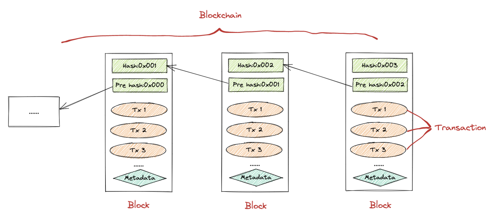

# 什么是区块链

**Twitter:** [@brycewai](https://twitter.com/brycewai)  
**所有代码和教程开源在Github:** [https://github.com/BryceWai/Web3-Security](https://github.com/BryceWai/Web3-Security)

## 概念

公认的最早关于区块链的描述性文献是中本聪所撰写的 [《比特币：一种点对点的电子现金系统》](https://bitcoin.org/bitcoin.pdf)
，但该文献重点在于讨论比特币系统，并没有明确提出区块链的术语。在其中，区块和链被描述为用于记录比特币交易账目历史的数据结构。

在Wikipedia上，将区块链类比为**一种分布式数据库技术，通过维护数据块的链式结构进行持续增长的、不可篡改的数据记录**。在百度百科上，**区块链是分布式数据存储、点对点传输、共识机制、加密算法等计算机技术的新型应用模式**。区块链，作为比特币底层技术的区块链技术，因为比特币而被广泛认知。

这里我们从狭义和广义两个层面来理解区块链的概念：

狭义的区块链技术是一种按照时间顺序将数据区块以链表的方式组合成特定数据结构，并以密码学方式保证的不可篡改和不可伪造的去中心化共享总账，能够安全存储简单的、有先后关系的、在系统内可验证的数据。

广义的区块链技术则是指利用加密技术来验证与存储数据、利用在区块链上的代码（即智能合约）来保证业务逻辑自动强制执行的一种全新的多中心化基础架构与分布式计算范式。

## 基本原理

区块链的基本原理理解起来并不复杂。首先来看三个基本概念：

- **交易（Transaction）**：一次对账本的操作，导致账本状态的一次改变成为一个交易。通俗理解就是所有链上的交互行为都可以理解为交易，比如转账、投票、兑换等。
- **区块（Block）**：记录一段时间内发生的所有交易和状态结果等，将这些交易和结果经过共识后打包成一个块就成为区块。
- **链（Chain）**：由区块按照发生顺序串联而成，是整个账本状态变化的日志记录。通俗理解就是上述的区块以特定的规则链接在一起，就是区块链。

如果把区块链系统作为一个状态机，则每次交易意味着一次状态改变；生成的区块，就是参与者对其中交易导致状态改变结果的共识。

区块链的目标是实现一个分布的数据记录账本，这个账本只允许添加、不允许删除。账本底层的基本结构是一个线性的链表。链表由一个个“区块”串联组成（如下图所示），后继区块中记录前导区块的哈希（Hash）值。某个区块（以及块里的交易）是否合法，可通过计算哈希值的方式进行快速检验。网络中节点可以提议添加一个新的区块，但必须经过共识机制来对区块达成确认。

## 特点

### 去中心化

在传统的交易管理中，可信赖的第三方机构持有并保管着交易账本，但建立在区块链技术基础上的交易系统，在分布式网络中用全网记账的机制替代了传统交易中第三方中介机构的职能。简单来说，区块链去中心化的实质就是去中介、去掉人为因素的干预和一些不必要的环节，去掉一个中心或中介来为信任背书。这种去中心化的信任机制可以让人们在没有中心化机构的情况下达成信任的共识。

但区块链也并不是绝对的去中心化。架构不同，去中心化的程度也不同：根据应用场景的不同，可以有完全去中心、多中心和弱中心。就像常说的公有链，它是一个开放给所有互联网用户的去中心化分布式账本，比如比特币、以太坊，都是完全去中心化的公有链架构。但是有些场景中，比如银行之间做的支付交易、跨境支付交易等，实际上是几个银行之间构建一个联盟链，是介于公有链和私有链之间的一种账本结构，是部分去中心化。再如，在一个企业内部构建的私有链中，区块链的共识机制、验证、读取等行为均由一个实体控制并只对实体内部开放，这种架构的中心化程度就是偏高的。

### 开放透明

区块链系统是开放的，整个系统的运行规则必须是公开透明的，参与系统的每个节点之间进行数据交换是无须互相信任的，除了交易各方的私有信息被加密外，区块链的数据对所有人公开，任何人或参与节点都可以通过公开的接口查询区块链数据或开发相关应用，因此整个系统信息高度透明，在系统指定的规则范围和时间范围内，节点之间是不能也无法欺骗其他节点的。

### 不可篡改

区块链是用一条链来链接的密码学技术，特别是哈希算法，可以保证任何交易都不能被篡改，因为一经修改，整条链都会变化。在区块链上，各个节点都保存有一份账本的信息，最终所有的节点都要去公认出一条最长的链来作为这份账本的最终状态，即一个又一个新产生的区块节点在经过验证后，会不断链接到现有区块链链条的尾端，每个节点也都将拥有一份完整的账本备份。因为链上每个节点的交易信息都要通过对应的每个交易发起人的私钥来签名，所以首先，这个交易是不可能被伪造的，其次，交易信息上链之后，除非所有人公认，或者同时控制住系统中超过51%的节点，否则单个节点对数据库的修改是无效的，也是几乎不可能实现的。

### 隐私匿名性

隐私匿名性，就是指区块链利用密码学的隐私保护机制，可以根据不同的应用场景来保护交易人的隐私信息，交易者在参与交易的整个过程中身份不被透露，交易人身份、交易细节不被第三方或者无关方查看。

通过密码学的隐私保护机制，区块链技术解决了节点间的信任问题。因为节点之间的交换可以遵循固定的算法，并且区块链中的程序规则会在数据进行交互活动时自行判断活动的有效性，所以链上的数据存储和交互可以在匿名而非基于地址和个人身份的情况下进行。无须通过公开身份的方式即可让对方对自己产生信任，这对信用的累积是非常有帮助的。

### 高可靠性

区块链技术通过共识算法保持各节点数据的高度一致，每一个全节点都会维护一个完整的数据副本，整个系统的正常运转不依赖个别节点。如果某个节点遇到网络问题、硬件故障、软件错误或者被黑客控制，则均不会影响系统以及其他参与节点。问题节点在排除故障并完成数据同步之后，便可以随时再加入系统中继续工作。

## **发展概述**

在近十年的发展历程中，区块链技术给政治、经济甚至是文化都带来了很大的影响。梅兰妮·斯万根据区块链的发展脉络将区块链的发展阶段分为区块链1.0、区块链2.0和区块链3.0时代，沿着这三个时代我们可以清晰地看到区块链的现状与未来。

### 区块链1.0时代

区块链1.0时代是以比特币、莱特币为代表的加密货币，具有支付、流通等货币职能。
2008年末，中本聪提出的区块链概念，即以区块形式的数据进行哈希加密并加上时间戳，然后将哈希广播出去，使其公开透明而且不可篡改，这解决了电子现金的安全问题。随着中本聪的第一批比特币被挖出来，区块链1.0时代也开启了，可以简单理解为区块链1.0时代和比特币、莱特币这些老牌数字货币挂钩。1.0时代做的不多，但是把区块链带入到了现实社会中，这就足够了。
最有名的莫过于2010年，一位名叫Laszlo Hanyecz的程序员用1万枚比特币购买了两个披萨。这被广泛认为是用比特币进行的首笔交易，也是币圈经久不衰的的笑话之一，很多币友将这一天称为“比特币披萨日”。但是从另一个角度来说，这次的行为将电脑中挖的那些虚拟货币与现实中的实物联系起来，这是具有里程碑意义的，因此是无价的。
在1.0时代，人们过多关注的只是建立在区块链技术上的那些虚拟货币，关注它们值多少钱、怎么挖、怎么买、怎么卖。不过时间久了，自然会有更多的人去关注技术本身，随后就是引发一场新的革命——区块链2.0时代。

### 区块链2.0时代

区块链2.0时代是以太坊、瑞波币为代表的智能合约或理解为“可编程金融”，是对金融领域的使用场景和流程进行梳理、优化的应用。
区块链2.0时代是智能合约开发和应用。智能合约是一种可以自动化执行的简单交易。举一个简单的例子，我跟你打一个赌，如果明天下雨，算我赢，如果明天没下雨，就是你赢了。然后我们在打赌的时候就把钱放进一个智能合约控制的账户内，第二天过去了，赌博的结果出来了以后，智能合约就可以根据收到的指令自动判断输赢，并进行转账。这个过程是高效、透明的执行过程，不需要公正等第三方介入。也就是说，有了智能合约以后，打赌就没办法赖账了。
在区块链2.0时代中最著名的莫过于具有智能合约功能的公共区块链平台以太坊了，也可以说是以太坊掀起了区块链2.0革命的浪潮。以太坊为了解决比特币的扩展性不足的问题而生，事实证明也确实如此，大量的token基于以太坊发行，疯狂之下，成功得将ETH推上了全球加密数字货币市值排行榜的第二名。但区块链的2.0技术只能达到每秒70至80次交易次数，这也成为其快速发展的制约性因素。于是，这就需要将眼光放到未来的3.0时代。

### 区块链3.0时代

政府通过发行货币等方式来量化信用，而区块链技术得到推广和普及之后，就会产生全面参与量化信用的热闹场面。信任是一种协议，存在于潜意识里，但潜意识多变，因而信任关系不稳定，而区块链就是用理性的技术，来解决人性中的不信任的问题。
区块链3.0阶段是构建一个完全去中心化的社会网络，这意味着可以极低的成本形成社会的信任关系，从而使整个社会运行成本大幅下降。区块链3.0之下可以实现自动化采购、智能化物联网应用、虚拟资产的兑换和转移、信息存证等等应用，可以在艺术、法律、开发、房地产、医院、人力资源等等各行各业发挥它的作用。它将不再局限于经济领域，可用于实现全球范围内日趋自动化的物理资源和人力资产的分配，促进科学、健康、教育等领域的大规模协作。区块链技术可以击碎所有造成中间成本的私有信用机构，让价值交换双方直接挂钩，它将重构整个社会。

## **分类**

### 公链

各个节点可以自由加入和退出网络，并参加链上数据的读写，读写时以扁平的拓扑结构互联互通，网络中不存在任何中心化的服务端节点。

- 一般以社区的形式使用Token激励的方式维持社区生态。
- 比特币（BTC）、以太坊、EOS等。

### 联盟链

- 各机构组织组成利益相关的联盟，共同维护区块链的健康运转。
- 各个节点通常有与之对应的实体机构组织，通过授权后才能加入与退出网络。
- Hyperledger Fabric、企业以太坊(Enterprise Ethereum)、 微众FiscoBCOS、蚂蚁BaaS、腾讯TBaaS、百度区块链引擎BBE等。

### 私链

- 仅仅使用区块链的总账技术进行记账，可以是一个公司，也可以是个人，独享该区块链的写入权限。
- 私有链与其他的分布式存储方案没有太大区别。
