# 以太坊模型详解

有人说，Web3就像《三体》中的“黑暗森林”，那么该课程将带你进入“猎人”的门。

**Twitter:** [@brycewai](https://twitter.com/brycewai)  
**Mirror:** [@Bryce.W](https://mirror.xyz/brycew.eth)  
**所有代码和教程开源在Github:** [https://github.com/HawkeWei/Web3-Security](https://github.com/HawkeWei/Web3-Security)

# 1 数据层

## 1.1 账户和账户地址

### **1.1.1 账户**

**外部账户**：由私钥控制；

**合约账户**：由代码控制；

每个账户都是由一个160位的地址组成，对应的账户中的状态包含余额（balance）、交易次数（nonce）及合约账户中的code(代码)、存储(stroge)。以下为合约账户的具体属性：

- `nonce` 已执行交易总数，用来标识该账户发出的交易数量；对于外部账户EOA，该值代表发送过的交易数量，序号从0开始递增；对于合约账户，该 值代表其创建的合约数量，序号从1开始递增；
- `balance` 持币数量，记录用户的以太币余额；
- `storage hash` 存储区的哈希值，指向智能合约账户的存储数据区；
- `code hash` 代码区的哈希值，指向智能合约账户存储的智能合约代码。

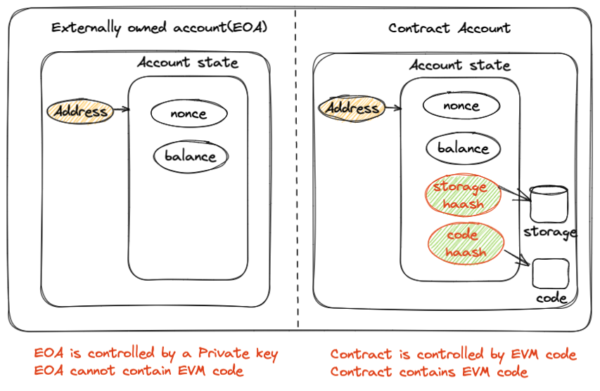

### 1.1.2 账户地址

- **外部账户地址**


1. 生成256 位随机数作为私钥。
2. 将私钥转化为secp256k1 非压缩格式的公钥，即512 位的公钥。
3. 使用散列算法Keccak256 计算公钥的哈希值，转化为32字节hash值。
4. 取十六进制字符串的后20字节，开头加上0x 作为**地址**。
- **合约账户地址**
  
    合约由其他账户创建，因此将创建者地址和创建者发送过的交易数量即nonce值进行哈希后截取部分生成。
    
    底层在虚拟机段是用**CREATE**命令生成智能合约地址的，当然后来虚拟机升级又新增了**CREATE2**指令来生成智能合约地址。
    
    `sender`和`nonce`进行RLP编码，然后用`Keccak-256`进行hash计算。
    
    ```
    keccak256(0xff ++ senderAddress ++ salt ++ keccak256(init_code))[12:]
    ```
    
    [EIP 1014: CREATE2 指令 | 以太坊改进提案 EIPs](https://learnblockchain.cn/docs/eips/eip-1014.html)
    

## 1.2 区块结构


### 1.3.1 区块头

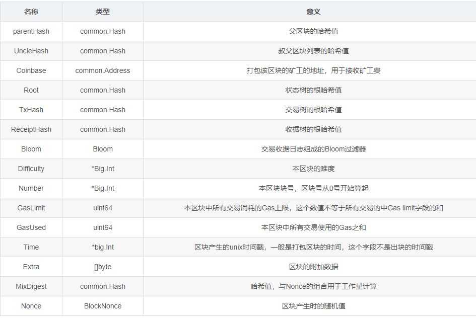

- ParentHash： 该区块的父区块的区块头哈希
- UncleHash： 该区块所包含的叔块的区块头list的哈希值
- Coinbase： 打包该区块矿工的地址，矿工费和打包区块的奖金将发送到这个地址
- Root： 存储账户状态的Merkle树的根节点的哈希
- TxHash： 存储该区块中的交易的Merkle树的根节点的哈希
- ReceiptHash：存储该区块的交易的回单的Merkle树的根节点的哈希
- Bloom： 交易日志的布隆过滤器，用于查询
- Difficulty： 该区块的难度
- Number： 区块号，也是区块高度，也是所有祖先区块的数量
- GasLimit： 该区块的汽油（gas）上限
- GasUsed： 该区块使用的汽油（gas）
- Time： 区块开始打包时间戳（调用Engine.Prepare函数的时候设置）
- MixDigest： 该哈希值与Nonce值一起证明该区块上已经进行了足够的计算，用于证明挖矿成功
- Nonce： 该哈希值与MixDigest哈希值一起证明该区块上已经进行了足够的计算，用于证明挖矿成功
- Extra： 矿工可控制的自定义信息

### 1.3.2 MPT

MPT全称Merkle Patricia Trie，是以太坊用来存储数据的一种数据结构。

MPT融合了Trie、Patricia Trie、Merkle Tree这3种数据结构的优点，从而实现快速查找并节省存储空间。

**MPT树的节点有以下4种类型：**

- 扩展节点（Extension Node）：只能有一个子节点。
- 分支节点（Branch Node）：可以有多个节点。
- 叶子节点（Leaf Node）：没有子节点。
- 空节点：空字符串。

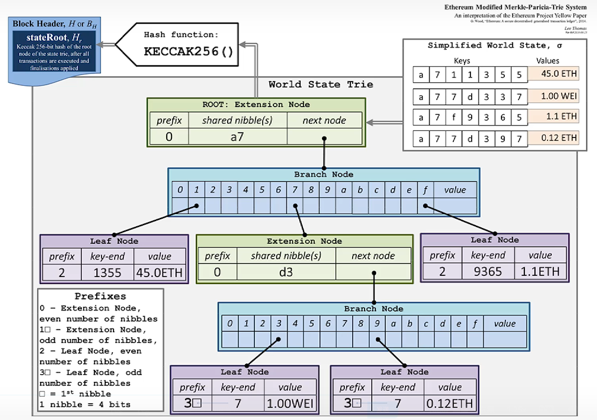

从上图看到，Key只在扩展节点和叶子节点中存在，分支节点中没有Key。Value用来存储节点数值的，不同的节点类型对应的Value值也会不同，主要如下几种情况：

- 若节点类型是叶子节点，Value值存储的是一个数据项的内容。
- 若节点类型是扩展节点，Value值存储的是孩子节点的哈希值。
- 若节点类型是分支节点，Value值存储的是刚好在分支节点结束时的值，若没有节点在分支节点中结束时，Value值没有存储数据。

以太坊的MPT树结构可以使得轻节点轻松实现如下类型查询：

1. 这笔交易是否包含在特定的区块中？
2. 某地址在过去17天中，发出M型事件的所有实例
3. 某账户的当前余额是多少？
4. 某账户是否存在？
5. 如果在合约中运行某笔交易，它的输出是什么？

其中，交易树可以处理第第一种查询（比特币系统类似），收据树可以处理第二种查询，而状态树可以处理第三、四、五种查询。这些查询任务在比特币系统中是相对困难的。

### 1.3.3 世界状态树

以太坊采取**MPT**存储账户状态，即默克尔前缀树。树的**叶子节点**就是账户对应的状态。

下图为以太坊发布新区块时，区块中状态树的改变：

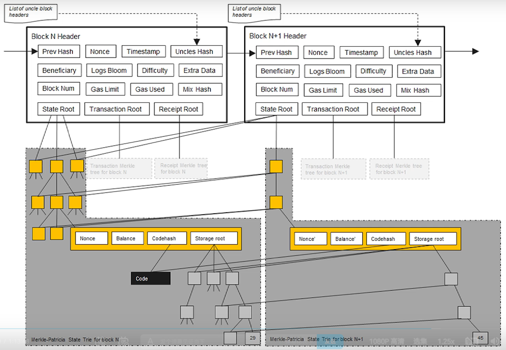

由上图可知，以太坊系统中不是所有节点都只维护一个全局MPT，而是每个区块都维护各自的一个MPT，不过这些区块中的节点都是共享的。每次发布新区块，MPT树中部分节点状态会改变，但改变并非在原地修改，而是新建一些分支，保留原本状态。当仅仅有新发生改变的节点才需要修改，其他未修改节点直接指向前一个区块中的对应节点。多个区块的状态树共享节点，只有改变了状态的节点需要新建分支。

保留历史状态是为了在区块链产生分叉时，需要进行账户状态的回滚，智能合约是图灵完备的如果不保存历史状态无法推算出历史状态，因此必须进行保存历史状态。

### 1.3.4 交易树

以太坊跟比特币一样，同样会在区块中打包交易，打包的交易以交易树的形式存储。

交易树和收据树**只包含当前区块中的交易**，而状态树是需将所有的账户都包含。

每个区块的交易树和收据树不会共享节点。

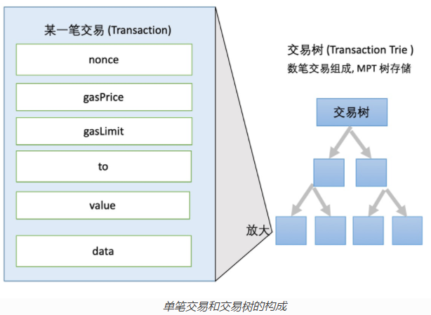

- nonce：交易序号。该值通常有两个作用，第一个作用是记录交易顺序：因为以太坊的所有交易都是基于account，不同于基于UTXO的比特币，因此需要对每次交易都按顺序记录，即nonce；第二个作用是防止重放攻击。在实际交易的过程中，该值还可以被用于加速或取消交易，即使用相同的 nonce 重新发起交易即可实现加速；
- gasPrice：用户愿意支付的gas单价，即为每个gas单位花费的Gwei
- gasLimit：用户愿意支付的最大gas
- to：交易的接受方
- value：交易转移的以太数量，单位是wei
- data：交易可携带的数据，可变长的二进制数据载荷，在不同类型的交易中有不同含义

💡 注意：交易中有data、input字段，推荐使用input，data主要是为了向后兼容。

**交易总共有三种类型：**

- **转账交易：**
  
    从一个账户直接向另一个账户发送以太；仅需指定交易的发送者、接收者、转账金额
    
- **创建合约的交易：**
  
    即将合约部署到区块链上，该笔交易中to字段留空，data字段指定合约二进制代码，from是交易发送者和合约创建者。如：
    
    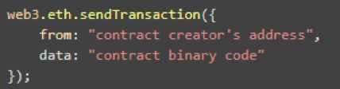
    
- **执行合约的交易：**
  
    即调用合约中的方法，需要将交易的to字段指定为要调用的合约地址，data字段指定要调用的方法和向该方法传递的参数。如：
    

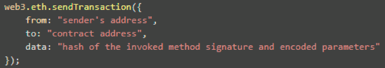

一段智能合约是被唯一的合约地址标识，该地址有自己的资金余额（Ether），并且一经检索到有一笔交易发送到该合约地址，以太坊网络节点就会执行合约逻辑。

**💡 交易的有效负载包含在两个字段中：value、data；**
仅有value：一笔Ether的付款
仅有data：合约调用
包含value、data：进行合约调用的同时，除了传输data，还可以传输Ether
没有value也没有data：浪费gas，但是有效

**注意**：以太坊单笔交易运行携带最大数据量为44KB

**交易的流程：**

以太坊交易的完整流程为：

1. 发起交易：指定目标地址和交易金额，以及需要的 gas/gaslimit
2. 交易签名：使用账户私钥对交易进行签名
3. 提交交易：把交易加入到交易缓冲池 txpool（会先对交易签名进行验证）
4. 广播交易：通知 EVM 执行，同时把交易信息广播给其他结点

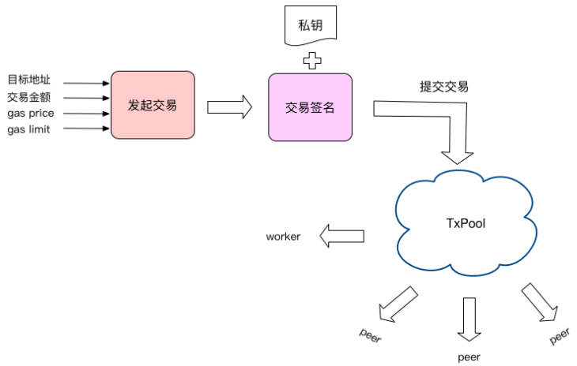

其中，交易缓冲池TxPool主要包含以下几个重要字段：

- pending：包含了当前所有可被处理的交易列表；
- queue：包含了所有不可被处理、也就是新加入进来的交易；
- all：所有的交易列表，以交易hash为key；
- priced：将all中的交易列表按照gas price从大到小排列；如果gas price一致，则按照交易的nonce值从小到大排列，最终的目标是每次取出gas price最大，nonce值最小的交易。

**交易的签名：**

创建完Transaction实例以后，会使用私钥对交易进行签名，具体流程如下图：

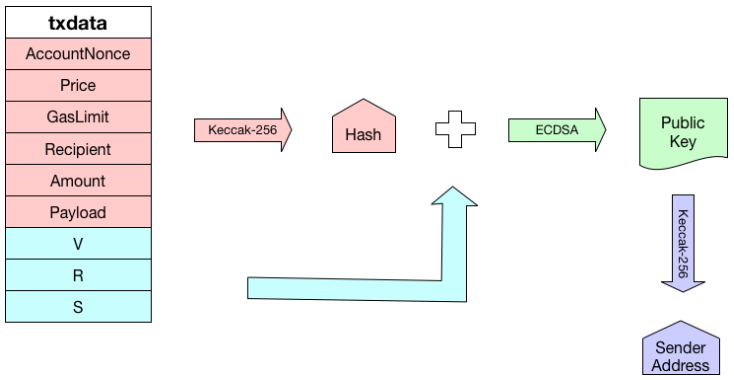

注意：首先通过Keccak-256算法计算待签名交易数据的hash值，然后结合账户私钥，通过ECDSA算法生成签名数据。此处生成的签名数据主要包含三部分值，即V、R、S；**为了避免以太坊在多链交互中遭受重放攻击**，V神在2016年提出了[EIP-155](https://eips.ethereum.org/EIPS/eip-155)规范，在交易的签名中增加了ChainID字段，即当block.number >= FORK_BLKNUM（2,675,000）时，对下列9个rlp编码元素进行哈希处理：

```
(nonce, gasprice, startgas, to, value, data, chainid, 0, 0)
```

- startgas：在交易加入到交易池时从输入参数中获取，一般由用户指定即Gaslimit；否则，使用默认值default_startgas = 500 * 1000
具体的计算流程为：

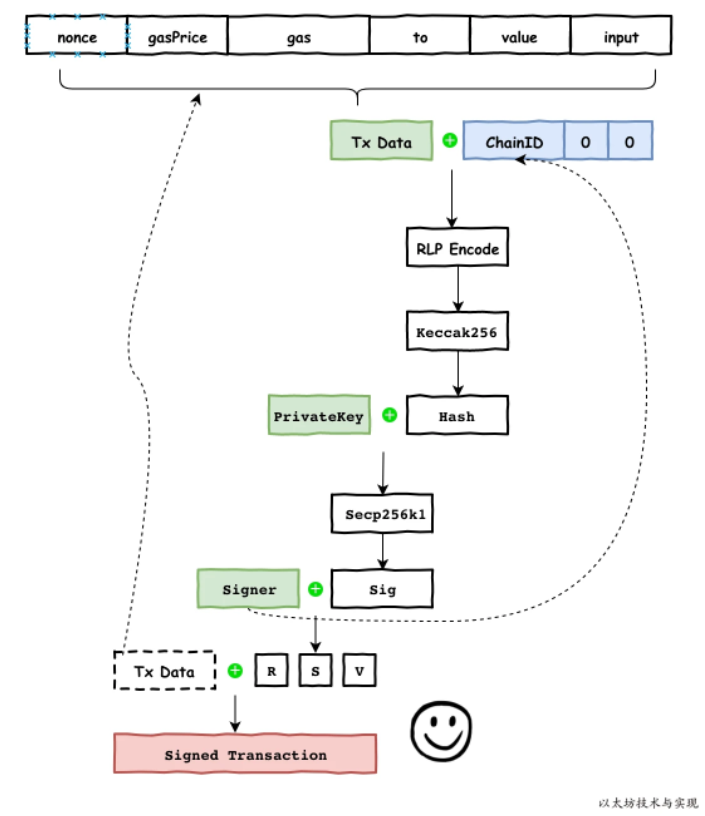

前面我们知道交易生成的签名值为R、S、V值，其中R和S是ECDSA签名的原始输出，而V值更改为：

```
v = CHAIN_ID * 2 + 35 或 v = CHAIN_ID * 2 + 36
```

下面列举一些常见的ChainID：

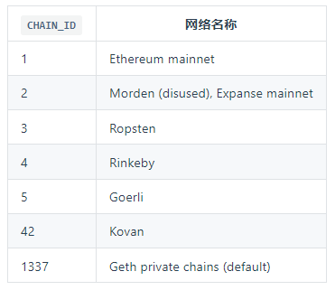

**交易的验证：**

交易被添加到交易缓冲池中时，会首先对交易进行验证，验证通过之后才会把交易加到queue列表中。 **验证主要分为以下几个方面**：

- 数据量必须小于32KB
- 交易金额必须为非负（>0）
- 交易的gas limit必须低于block的gas limit
- 签名数据必须有效，能够解析出发送者地址
- 交易的gas price必须高于pool设定的最低gas price（除非是本地交易）
- 交易的nonce值必须高于当前链上该账户的nonce值（低于则说明这笔交易已经被打包过）
- 当前账户余额必须大于”交易金额+gasprice*gaslimit“
- 交易的gaslimit必须大于对应数据量所需的最低gas值

💡 注意：如果用户发起了一笔交易，在没有被执行前又用同样的nonce发起了另一笔交易，则只会保留gasprice高的一笔。

**交易的执行：**

按照以太坊架构设计，交易的执行可大致分为内外两层结构：

- 第一层是虚拟机外，包括执行前将 Transaction 类型转化成 Message，创建虚拟机(EVM)对象，计算一些 Gas 消耗，以及执行交易完毕后创建收据(Receipt)对象并返回等；
- 第二层是虚拟机内，包括执行 转帐，和创建合约并执行合约的指令数组。

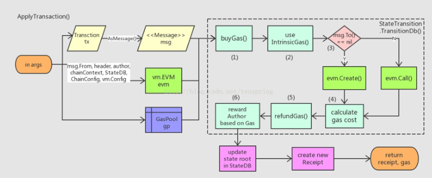

### 1.3.5 收据树

**作用**：每个交易执行完会生成一个收据（Receipt），记录这个交易的相关信息，与交易树上的节点**一一对应**，且数据结构都为MPT。智能合约执行过程比较复杂，增加收据树，有助于快速查询一些交易执行结果。

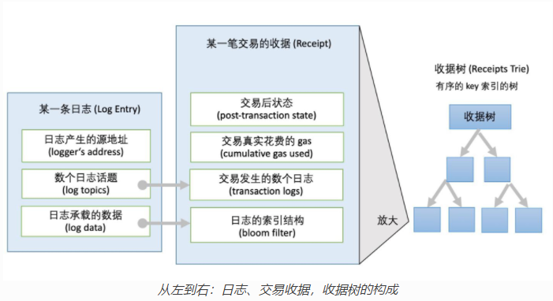

- post-transaction state：保存了创建该 Receipt 对象时，整个 Block 内所有“帐户”的当时状态；
- the cumulative gas used：交易真实花费的gas
- transaction logs：每一个log对象记录了交易Tx中一小步的操作，因此每一个Tx的执行结果由一个Receipt对象表示，更详细的内容由一组Log对象记录。该log对象数组很重要，如：在不同Ethereum 节点(Node)的相互同步过程中， 待同步区块Receipt中的Log 数组有助于验证同步中收到的 block 是否正确和完整，所以会被单独同步（传输）。
- bloom filter：可用于快速验证一个对象是否处于一个已知的集合中，即某个log是否处于Receipt已有的Log数组中。发布的区块在块头中也有一个总的bloom filter，是各个交易中的bloom filter的并集。查找时，先查哪个区块头中的bloom filter中包含我要的交易类型，如果块头的bloom filter里没有，那就没有。

### 1.3.6 Gas，Gasprice，Gaslimit，GasUsed

区块消耗的计算资源不能无限制，所以在比特币中会对其大小进行限制；在以太坊中不采用这种方式，因为以太坊是图灵完备的，它本身可能代码量很少但是造成的计算量却很大。所以必须采用其他方式对其进行限制，这就是汽油费。

- **Gas**

交易发起人需要为以太坊区块链上的每项操作支付的执行费的名称。gas和ether有意地解耦，但二者价格都由自由市场调节。因为gas的价格实际上由旷工决定，因为他们可以拒绝处理gas价格低于最低限额的交易。只需在账户中添加一定的以太就可以获得gas，因为以太坊客户端会自动用以太购买gas，金额为Gaslimit，作为交易的最大支出；

- **Gaslimit**

交易发起者设置的该区块消耗的gas上限，防止一些合约 bug 比如无限循环而消耗掉账户中的所有的 ETH，Gas 消耗超过 GasLimit 时，交易会执行失败。

**GasLimit 由用户自己设置，但是必须大于等于 21000 Gas unit。**

💡 Gaslimit不是区块中所有交易消耗的汽油费limit之和，因为每个交易中Gaslimit都是可以自己定义的，如果采取所有交易Gaslimit之和的方式相当于就没有限制。因此必须规定一个区块中所有交易实际能消耗的Gas上限。但是每个矿工可以在自己的区块中上调或者下调1/1024，这跟比特币中写死在协议中的1M有区别。

- **Gasprice**

Gasprice指一个Gas的单价，一般用Gwei表示，但应用程序中大多使用Wei。**该值由用户自己设置**，其大小会决定交易被处理的速度。

- **GasUsed**

EVM中的每个操作都指定了要消耗的 gas 量。 gasUsed是执行所有操作的所有gas的总和；

交易费用 = 程序消耗的 GasUsed* 用户设置的 GasPrice

下面是一些常见操作消耗的Gas：

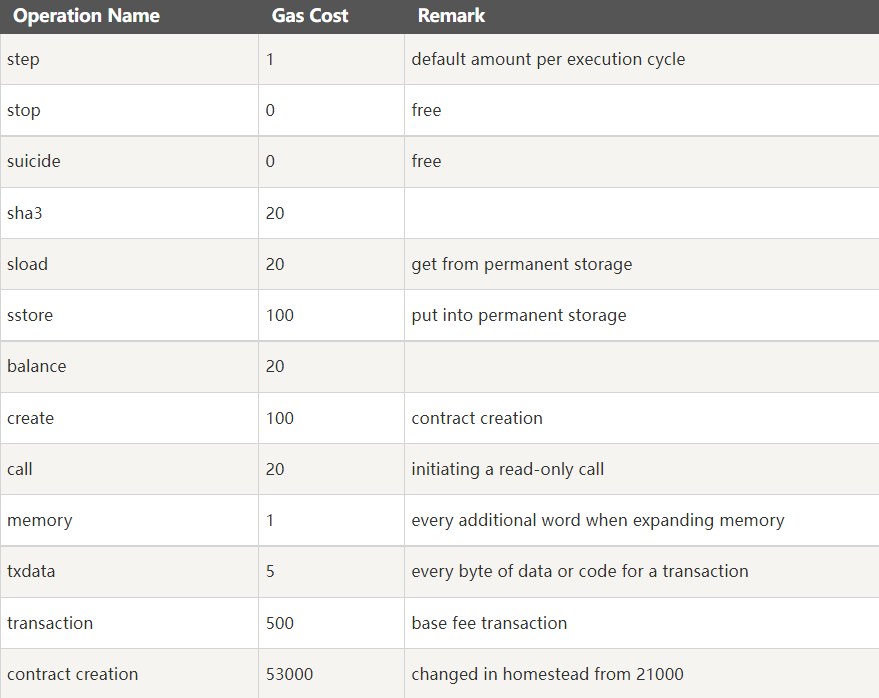

# 2 网络层

以太坊网络层参考[比特币网络层架构](./btc-model-analysis.md#2-网络层)，此处不做过多赘述。

# 3 共识层

以太坊目前仍然采用PoW共识算法，但计划在2022年迁移为PoS权益证明共识算法。同时由于出块时间、区块等与比特币存在显著差异，所以在PoW基础上增加了Ghost协议，同时区块的验证算法也有不同。下文将针对二者进行详细介绍。

## 3.1 Ghost协议

- **产生原因**
- 由于以太坊的平均出块时间为12-14s，所以如果以太坊按照比特币系统的共识协议PoW进行挖矿，那么会存在如下两个问题：
    1. 由于出块时间很短，导致系统中出现分叉的概率会更高，而大型矿池所在的分叉由于算力远大于其他分叉具有的节点，会造成大型矿池所在分叉更有成为最长合法连的可能。导致不公平的产生，因为即使与该矿池节点同时挖到矿，但是后续仍然由于算力会使得自己所在分叉失效，白挖。
    2. 由于区块链底层的P2P网络是分布式节点，所以本身数据传输速度就比较慢。比特币的10分钟出块时间可以保证网络中所有节点都可以收到新挖出的区块。而以太坊的出块时间太短，可能新区块已经产生，其他节点还没有收到。此时大型矿池因为其地理优势，会更具传播优势，因为大型矿池一般都有很多分散的节点，或者也更有可能占据网络拓扑中中心的位置。这样就使得大型矿池发布的节点，更有可能被其他节点收到。
    
    综上，以太坊不能直接采用比特币的PoW共识机制，这样会使得算力过于集中降低其他矿工的积极性，所以以太坊在PoW共识算法的基础上新增了Ghost协议。
    
- **算法流程**
- uncle block：挖到矿了没被认可，也可以得到一些出块奖励。但是规定最多只能包含2个。
  
    包含uncle block可以得到32分之1的出块奖励。
    
    如下图：
    
    假设当前区块奖励为3 ETH，则图中叔块奖励为7/8 * 3，而当前区块引用了2个区块，则当前区块的总收益为：2 * 1/32 *3 + 3
    
    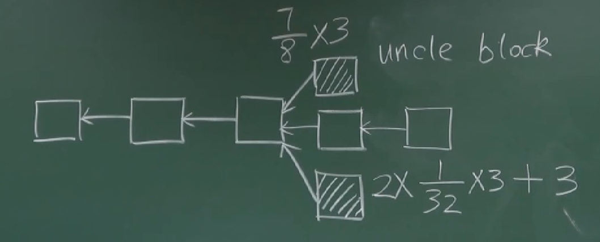
    
    但是采取这样方式， 可能有些矿池处于商业竞争关系，会故意不包含叔父区块。这样叔父区块还是白挖了。于是以太坊针对这样进行了如下改进：
    
    即不论资排辈，后面的区块都可以包含之前区块未包含的叔父区块。即扩展了叔父的定义，即可以隔很多代。
    
    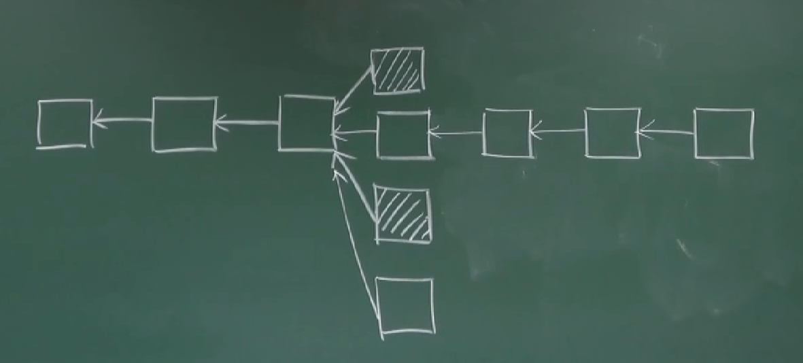
    
    但是采取这样方式，有些节点可以在挖矿难度很低的时候疯狂挖矿，然后产生很多叔父区块期待被包含。于是以太坊又作出了如下改进：
    
    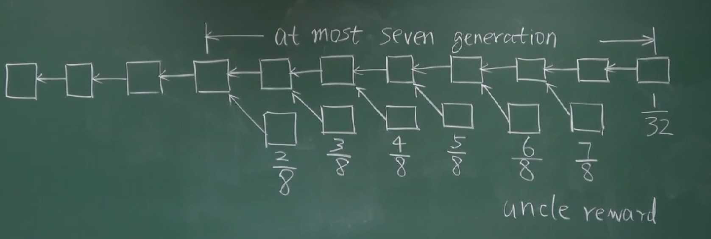
    
    综上，合法的区块只有6个辈分。
    
    **这样设计的目的：减少全节点维护的状态信息；鼓励节点出现分叉后及早进行合并。与比特币相比，以太坊不以最长合法链为主链，而是包含区块最多的链。**
    

## 3.2 区块验证

其中，最重要的工作是什么样的区块才会被各个节点认为是合法的，即区块的验证。具体流程如下图所示：

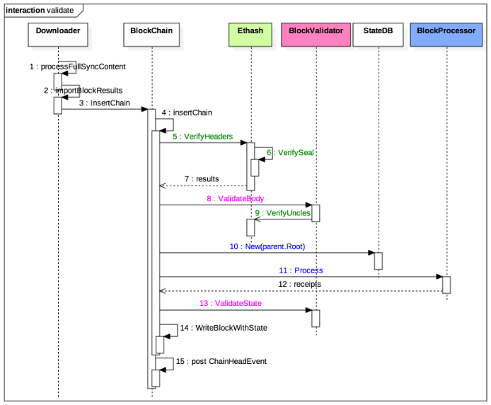

- 验证区块头：Ethash.VerifyHeaders()
- 验证区块体：BlockValidator.VerifyBody()（内部还会调用Ethash.VerifyUncles()）
- 执行区块交易：BlockProcessor.Process()（基于其父块的世界状态）
- 验证状态转换：BlockValidator.ValidateState()

如果上述验证成功，则往数据库写入区块信息，然后广播ChainHeadEvent事件。

**区块头验证：**

首先通过ChainReader拿到父块的header，然后调用ethash.verifyHeader()验证区块头 ，具体细节在以太坊黄皮书的4.3.4节所定义。这个函数比较长，大概列一下有哪些检查项：

- 时间戳超前当前时间不得大于15s
- 时间戳必须大于父块时间戳
- 通过父块计算出的难度值必须和区块头难度值相同
- 消耗的gas必须小于gas limit
- 当前gas limit和父块gas limit的差值必须在规定范围内
- 区块高度必须是父块高度+1
- 调用ethash.VerifySeal()检查工作量证明
- 验证硬分叉相关的数据

**区块体验证：**

区块体的验证分为两部分，包括叔块和区块体的验证，具体流程如下：

1.**叔块验证**

- 遍历当前块包含的叔块，做以下检查：
- 如果祖先块中已经包含过了该叔块，返回错误；
- 如果发现该叔块其实是一个祖先块（即在主链上），返回错误；
- 如果叔块的父块不在这7层祖先中，返回错误；
- 如果叔块和当前块拥有共同的父块，返回错误（也就是说不能打包和当前块相同高度的叔块）；
- 最后验证一下叔块头的有效性；

2.**区块体验证**

- 判断当前数据库中是否已经包含了该区块，如果已经有了的话返回错误；
- 判断当前数据库中是否包含该区块的父块，如果没有的话返回错误；
- 验证叔块的有效性及其hash值；
- 计算块中交易的hash值并验证是否和区块头中的hash值一致；

3.**执行区块交易：**

- 调用Prepare()计算难度值
- 调用ApplyTransaction()执行交易并获取交易回执和消耗的gas值
- 通过Finalize()生成区块

4.**验证状态转换：**

验证区块中和状态转换相关的字段是否正确，包含以下几个部分：

- 判断刚刚执行交易消耗的gas值是否和区块头中的值相同
- 根据刚刚执行交易获得的交易回执创建Bloom过滤器，判断是否和区块头中的Bloom过滤器相同（Bloom过滤器是一个2048位的字节数组）
- 判断交易回执的hash值是否和区块头中的值相同
- 计算StateDB中的MPT的Merkle Root，判断是否和区块头中的值相同

至此，区块验证流程就走完了，新区块将被写入数据库，同时更新世界状态。

# 4. 合约层

## 4.1 智能合约

智能合约是以太坊的核心特色，它允许在不需要第三方的情况下，执行可追溯、不可逆转和安全的交易。也可以说，智能合约是分布式的程序脚本，类似自动化的程序合同，在符合设置的条件后触发自动执行。

其主要优势包括在处理代码逻辑时的更高效率，归功于它能够采用完全自动化的流程，不需要任何人为参与，只要满足智能合约代码所列出的要求即可。节省时间，降低成本，安全可信，交易准确，能排除任何第三方干扰，进一步增强了网络的去中心化。缺点就是缺乏法律监管，人为的代码程序错误和实施有困难。

目前去中心化交易所基本都会用到智能合约，比如鲸交所上面的撮合交易，转账都是通过智能合约完成。彩票、博彩游戏等对透明公平性要求比较高的场景，智能合约都是最佳的选择。
金融衍生品是智能合约最著名的应用，也是最易于用代码实现的之一，比如最近两年很火的去中心化金融DEFI。例如选举、房产艺术品交易、电子合同、政府交易、医疗管理、高等教育课程管理和保险等任何需要商品交换或验证的场景，都可以充分利用智能合约。

### 4.1.1 以太坊代币

基础补充：
以太坊中的gas和ether是什么：[https://www.jianshu.com/p/64c42b692c6b](https://www.jianshu.com/p/64c42b692c6b)
以太单位在线换算：[https://converter.murkin.me/](https://converter.murkin.me/)

在以太坊系统中，存在作为基础货币的 Ether（以太），以及同样可以作为货币使用的 Token（代币）。以太坊与其他加密货币的主要不同在于，以太坊不是单纯的货币，而是一个环境/平台。在这个平台上，任何人都可以利用区块链的技术，通过智能合约来构建自己的项目和DAPPS（去中心化应用）。

如果把以太坊理解成互联网，DAPPS则是在上面运行的网页。DAPPS是去中心化的，意味着它不属于某个人，而是属于一群人。DAPPS发布的方式通常是采用被称为 ICO 的众筹方式。简单来说，你需要用你的以太来购买相应DAPP的一些tokens。

**一般有两种Token：**
1.Usage Tokens：就是对应 DAPP 的原生货币。Golem 就是一个很好的例子，如果你需要使用 Golem 的服务，你就需要为其支付 Golem Network Token（GNT）。由于这种 Tokens 有货币价值，所以通常不会有其他的权益。

2.Work Tokens：此类 Tokens 可以标识你对于 DAPP 的某种股东权益。以 DAO tokens 为例，如果你拥有DAO tokens，那么你有权就DAO是否资助某款 DAPP 来进行投票。

类比到股权，可以把 Usage Tokens 简单理解为普通流通股，可以与真实货币兑换，本身具有价值。而 Work Token，则大致相当于投票权。

为何需要Token？不是有以太基础货币了，那为什么还需要token呢？可以想下现实生活的真实场景，在游乐场里，我们需要用现金兑换代币，然后用代币支付各种服务。 类比到以太坊，现金就是以太，代币就是token，用token来执行合约中的各项功能。

### 4.1.2 以太坊token标准

所有遵循 ERC20 标准的函数，都要事先它定义的标准接口。
ERC-20标准是在2015年11月份推出的，使用这种规则的代币，表现出一种通用的和可预测的方式。任何 ERC-20代币都能立即兼容以太坊钱包（几乎所有支持以太币的钱包，包括Jaxx、MEW、imToken等），由于交易所已经知道这些代币是如何操作的，它们可以很容易地整合这些代币。这就意味着在很多情况下，这些代币都是可以立即进行交易的。简单理解就是，ERC20是开发者在自己的tokens中必须采用的一套具体的公式/方法，从而确保不同DAPP的token与ERC20标准兼容。
ERC-20 标准规定了各个代币的基本功能，非常方便第三方使用，在开发人员的编程下，5分钟就可以发行一个 ERC-20代币。因为它可以快速发币，而且使用又方便，因此空投币和空气币基本上就是利用 ERC-20标准开发的。基于 ERC-20标准开发的同种代币价值都是相同的，它们可以进行互换。ERC-20 代币就类似于人民币，你的100元和我的100元是没有区别的，价值都是100元，并且这两张100元可以进行互换。有了这套标准，相当于全世界都使用人民币，而不用去别的国家还要计算汇率换成别的货币。想象下，每个Dapp都有不同格式的币，那对于这些应用的交互简直是种灾难。

etherscan上开源的ERC20标准的智能合约：[https://etherscan.io/tokens](https://etherscan.io/tokens)
一份以太坊代币合约详解：[https://www.cnblogs.com/he1m4n6a/p/9327589.html](https://www.cnblogs.com/he1m4n6a/p/9327589.html)

```
contract ERC20 {
  function totalSupply() constant returns (uint totalSupply);
  function balanceOf(address _owner) constant returns (uint balance);
  function transfer(address _to, uint _value) returns (bool success);
  function transferFrom(address _from, address _to, uint _value) returns (bool success);
  function approve(address _spender, uint _value) returns (bool success);
  function allowance(address _owner, address _spender) constant returns (uint remaining);
  event Transfer(address indexed _from, address indexed _to, uint _value);
    event Approval(address indexed _owner, address indexed _spender, uint _value);
}
```

函数：
注意：非常重要的一点是调用者应该处理函数返回的错误，而不是假设错误永远不会发生。

- totalSupply：返回token的总供应量
- balanceOf：用于查询某个账户的账户余额
- tansfer：发送*value 个 token 到地址*to
- transferFrom：从地址*from 发送*value个token 到地址_to
- approve：允许*spender 多次取回您的帐户，最高达*value 金额；如果再次调用此函数，它将用_value的当前值覆盖的allowance值。
- allowance：返回*spender仍然被允许从*owner提取的金额。

事件：

- event Transfer：当tokens被转移时触发。
- event Approval：当任何成功调用approve(address _spender, uint256_value)后，必须被触发。

## 4.2 Solidity

参见[Solidity官方开发文档](https://solidity-cn.readthedocs.io/zh/develop/index.html):

- [1. Solidity编译器](https://solidity-cn.readthedocs.io/zh/develop/installing-solidity.html)
- [2. 基本结构](https://solidity-cn.readthedocs.io/zh/develop/structure-of-a-contract.html)
- [3. 类型](https://solidity-cn.readthedocs.io/zh/develop/types.html)
- [4. 单位和全局变量](https://solidity-cn.readthedocs.io/zh/develop/units-and-global-variables.html)
- [5. 表达式和控制结构](https://solidity-cn.readthedocs.io/zh/develop/control-structures.html)
- [6. 合约](https://solidity-cn.readthedocs.io/zh/develop/contracts.html)
- [7. Solidity汇编](https://solidity-cn.readthedocs.io/zh/develop/assembly.html)
- [8. ABI](https://solidity-cn.readthedocs.io/zh/develop/abi-spec.html)

# 5. 应用层

## 5.1 DApp

去中心化应用(Decentralization APP)，其本质就是智能合约。

一个DApp有后台代码运行在分布式点对点网络中，传统APP的后台代码是运行在中心化的服务器，两者并不是取代关系，而是并存关系。在底层区块链平台生态上衍生的各种分布式应用，也是区块链世界中的基础服务提供方。

常见的DAPP有金融类、游戏博彩类、内容分发类等等。
例如，金融类有DEFI去中心化金融，包括货币发行、货币交易、借贷、资产交易、投融资等；
再例如，游戏博彩类，有卡牌游戏Crptokitties(迷恋猫)、百度的莱茨狗等；
内容分发类如国外的steemit，国内的币乎、币问、Primas、Iveryone、Pressone等。

## 5.2 ICO

ICO（是Initial Coin Offering缩写），首次币发行，源自股票市场的首次公开发行（IPO）概念，传统的众筹是以产品和服务为回报募集资金，而区块链上的融资则以代币、发币为回报，募集代币或者法币。

2017年9月4日，中国人民银行领衔网信办、工信部、工商总局、银监会、证监会和保监会等七部委发布《关于防范代币发行融资风险的公告》，《公告》指出代币发行融资本质上是一种未经批准非法公开融资的行为，要求自公告发布之日起，各类代币发行融资活动立即停止，同时已完成代币发行融资的组织和个人做出清退等安排，在法律法规上实行了重要的监管措施。

以下按照时间顺序，列出有代表性的国际ICO案例：

- 2013年7月，Mastercoin（现更名为Omni）：可查的最早ICO项目，通过meta-protocol拓展比特币功能，募集5000 BTC。
- 2013年12月，NXT（未来币）：首个完整的PoS区块链，曾经神秘的开发者，持续发展的强大社区。ICO神话：募集21BTC（约等于当时6000美元），市值峰值曾到达过1亿美元。
- 2013年-2014年，Bitshares（比特股）：曾经的“数字资产二代币三剑客”之一（另外两个为NXT和CounterParty），国内数字货币界口水之源，毁誉参半。其社区培养了国内大量早期ICO以及数字资产爱好者。
- 2014年7月，Ethereum（以太坊）：ICO时募集3万余个比特币曾创下纪录。将智能合约理念推进到极致的区块链项目，让全世界重新认识区块链公有链的项目。近两年最成功的ICO，也是至今为止除比特币以外市值最高的数字货币/区块链项目。
- 2015年3月，Factom（公正通）：双代币设计，首提存在性证明的区块链商业化以及由此导出的基金会与公司双机构设置。
- 2016年3月，Lisk：以太坊挑战者，利用侧链的Dapp解决方案。
- 2016年5月，TheDAO：等值1.5亿美元破世界纪录的ICO众筹，非典型ICO（其本身不是区块链）。向世界大声宣告智能合约时代到来后一个月即被黑客攻克，在历史上刻下了大大的惊叹号。

## 5.3 DeFi

即Decentralized Finance，常被称作：分布式金融或者去中心化金融。

在现有的金融系统中，金融服务主要由中央系统控制和调节，无论是最基本的存取转账、还是贷款或衍生品交易。DeFi则希望通过分布式开源协议建立一套具有透明度、可访问性和包容性的点对点金融系统，将信任风险最小化，让参与者更轻松便捷地获得融资。与传统金融相比，去中心化金融通过区块链技术实现了去中介化，减少了中间人角色，从而降低了中间环节的所带来的巨额成本。

DeFi是个较为宽泛的概念，包括：货币发行、货币交易、借贷、资产交易、投融资等。

相比传统的中心化金融系统，这些DeFi平台具有三大优势：
a. 有资产管理需求的个人无需信任任何中介机构新的信任在机器和代码上重建；
b. 任何人都有访问权限，没人有中央控制权；
c. 所有协议都是开源的，因此任何人都可以在协议上合作构建新的金融产品，并在网络效应下加速金融创新。