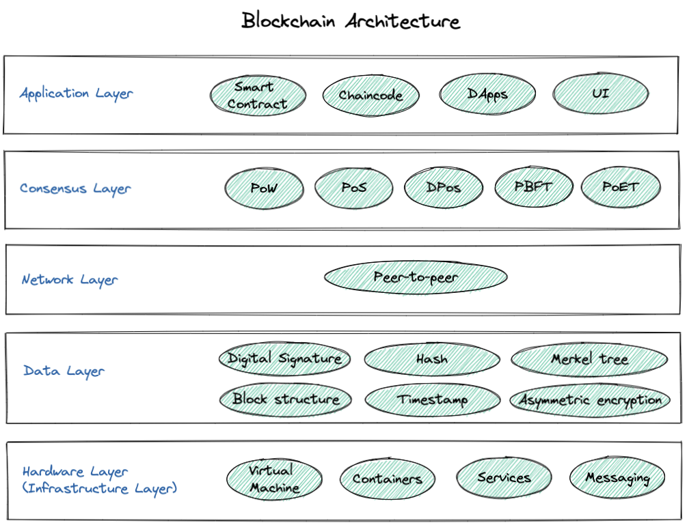

# 区块链通用模型

有人说，Web3就像《三体》中的“黑暗森林”，那么该课程将带你进入“猎人”的门。

**Twitter:** [@brycewai](https://twitter.com/brycewai)  
**Mirror:** [@Bryce.W](https://mirror.xyz/brycew.eth)  
**所有代码和教程开源在Github:** [https://github.com/HawkeWei/Web3-Security](https://github.com/HawkeWei/Web3-Security)

---

区块链的通用模型中，一般有两种描述区块链技术的方法。一种是从区块链架构的工作原理去描述，通常为五层架构模型；另一种是从区块链网络协议的角度去描述，一般分为四层协议。下面分别介绍。

## **区块链分层架构**

通常区块链架构由五层组成：硬件层、数据层、网络层、共识层和应用层。

下面我们对每一层进行简单介绍：

### 硬件（基础设施）层（Hardware/Infrasturcture Layer）

区块链的第一层由硬件组成，如网络连接、网络中的计算机和数据服务器。存储在区块链中的数据由数据服务器托管，区块链网络上的计算机可以相互共享这些数据 。这导致创建 P2P 网络，其中信息由网络上的各个节点（或计算机）验证。

### 数据层（Data Layer）

数据层上，存放着区块链上所有的数据信息，是整个区块链技术中最底层的数据结构。从没有记录交易的创世区块起，到不断新增区块，构成的链式结构，里面封装了哈希值、认证交易的时间戳、交易信息、公私钥等，确保了数据在全网公开时的情况下所有数据的安全性。

在区块链网络上，节点间采用共识算法维护数据层数据的一致性，通过密码学中非对称加密和哈希算法，保证了这个分布式数据库中数据信息的不可篡改和可追溯。区块链的数据采相当于一个不可篡改、具有分布式等特性的数据库。

### 网络层（Network Layer）

区块链技术没有中心化服务器，依靠用户点对点交换信息，这就需要网络层来实现。

其功能是实现区块链网络中节点与节点之间的信息交流，主要包括P2P组网机制、数据传播和验证机制。正是由于区块的P2P特性，数据传输是分散在各个节点之间进行的，部分节点或网络遭到破坏对其他部分影响很小。

分布式算法以及加密签名等都在网络层中实现，区块链上的各个节点通过这种方式来保持联系，共同维护整个区块链账本，比较熟知的有闪电网络、雷电网络等第二层支付协议。

### 共识层（Consensus Layer）

共识层主要包括共识算法机制。也就是在全网形成一个统一的、所有节点一致认可的规则，以此来维护和更新区块链系统这个总账本。让高度分散的节点在去中心化的区块链网络中达成高效的共识，是区块链的核心技术之一，也是区块链社区的治理机制。目前为止有比特币的工作量证明（PoW）、以太坊2.0的权益证明（PoS）、EOS的委托权益证明（DPoS）、PoW 和 PoS 结合、燃烧证明、重要性证明等十几种共识机制。

### 应用层（Application Layer）

智能合约、链码和去中心化应用程序 (DApps) 构成了应用程序层。应用层协议进一步细分为应用层和执行层。应用层包括最终用户用来与区块链网络通信的程序。脚本、应用程序编程接口 (API)、用户界面和框架都是其中的一部分。

区块链网络充当这些应用程序的后端技术，它们通过 API 与其通信。智能合约、底层规则和链码都是执行层的一部分。

尽管事务从应用层移动到执行层，但它在语义层得到验证和执行。应用程序向执行层发出指令，执行层执行交易并确保区块链的确定性。

## 区块链协议

### Layer 0

区块链零层由有助于使区块链成为现实的组件组成。它是允许比特币、以太坊和其他区块链网络运行的技术。第 0 层组件包括互联网、硬件和连接，这些组件将使第 1 层能够顺利运行。

### Layer 1

该层是区块链协议的基础层，其安全性基于其不变性。该层负责共识过程、编程语言、区块时间、争议解决以及维护区块链网络基本功能的规则和参数。它也被称为实现层。比特币、以太坊、币安链都是第一层区块链的例子。

### Layer 2

该层是区块链协议的执行层。随着区块链的增长，对其执行的交易数量也会增加。为了支持增加的交易数量，我们需要可扩展性（ 处理增加的负载的能力）第 2 层解决方案。协议通过从基础层移除一些交互来利用第二层来增加可扩展性。因此，主区块链协议上的智能合约只处理存款和取款，并确保链下交易遵守规定。比特币的闪电网络是第二层区块链的一个例子。

目前基于 Layer 2 层的技术包括嵌套区块链、状态通道、侧链等。

### Layer 3

该层是区块链协议的应用层。它由我们今天在市场上看到的不同的基于区块链的应用程序（Dapp ）和去中心化自治组织（DAO）组成。

